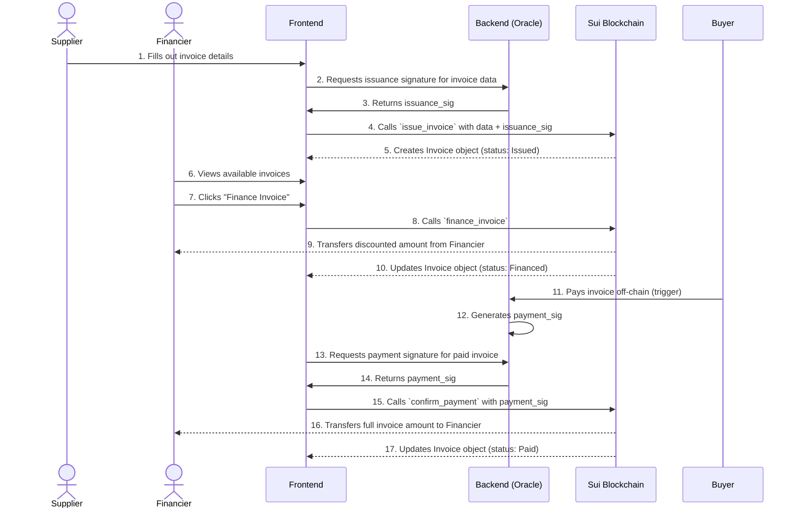

# ChainInvoice: On-Chain Invoice Financing and Settlement

## Overview

ChainInvoice is a decentralized application (dApp) built on the Sui blockchain that enables businesses to finance their invoices through on-chain mechanisms. By leveraging smart contracts, ChainInvoice facilitates secure and transparent invoice financing and settlement processes.

### What this is about

Convert supplier invoices into on-chain, tradeable invoice-objects that financiers can buy at a discount. When the invoice is paid (confirmed by trusted sources), settlement happens on-chain and proceeds are released to the financier. It’s invoice factoring / receivables financing reimagined with verifiable proofs and fast settlement.

### Why SUI is a great fit

- **High Throughput & Low Latency**: Sui's architecture allows for fast transactions, enabling quick financing and settlement cycles.
- **Move Language**: The Move programming language provides strong safety guarantees, ensuring the integrity of financial transactions.
- **Shared Objects**: Sui's shared object model allows for efficient access control and state management, crucial for multi-party financial agreements.

#### Core Strategic Fit (High-Level / Business Lens)

Sui lets us treat each invoice as a “living digital asset” (an object) whose ownership, financing status, and settlement evidence evolve transparently. This maps directly to real-world receivables lifecycles:

- Issue → Finance → Await Payment → Paid / Disputed.
  Traditional chains treat everything as balances and events; Sui gives us a first-class object with built-in safety around ownership and mutation. That reduces complexity, improves auditability, and enables fast iteration in a hackathon setting.

### Core actors & responsibilities

- **Supplier (Seller)**: creates invoice, requests early funding.
- **Financier (Funders / LPs)**: buys invoice at discount, earns yield upon settlement.
- **Buyer (Debtor)**: pays invoice at maturity (off-chain in reality). For demo, can be simulated or represented by an authority.
- **Verifier / Oracle**: confirms invoice payment (bank confirmation, payment gateway, escrow). Critical trust piece.
- **Platform (you)**: UI, KYC onboarding, marketplace, escrow integration, optional insurance layer.

#### Core Interaction Flow (Sequence Diagram)

This diagram shows the end-to-end process from invoice creation to final settlement, involving the supplier, financier, and the off-chain oracle.

### Minimum trust model
You cannot and should not put PII or raw bank data on chain. Real deployments require legal agreements and KYC.
- Keep **only hashes and non-PII metadata** on chain.
- Use an **authority signature model**: verified authority signs the invoice issuance and later signs payment confirmation. On-chain you store issuer-approved hashes + signatures.
- Use **oracles** (or a simple off-chain oracle server you control) for bank/payment confirmations.

## Local Development Quickstart
- setup Sui dev environment: https://docs.sui.io/build/install
- configure sui client to use testnet
  - RUN `sui client` to verify connection
  - RUN `sui client switch --env testnet` to switch to testnet
  - RUN `make setup_active_address` to set your active address in .env
    - This is used by scripts to deploy and interact with contracts from your wallet
    - The Active Address is publc and safe to share - it is you public wallet address
  - RUN `sui client addresses` to list all your addresses
  - RUN `cat ~/.sui/sui_config/sui.keystore` - to get you private key for testnet faucet,
    - the value between square brackets `[]` is your private key you need it to add your local testnet wallet to the wallet APP (eg. Sui Wallet Chrome Extension, Slush Wallet, etc)
    - Keep your private key safe and do not share it with anyone
    - RUN `sui keytool convert <your-private-key> ` to convert it to hex format if needed for wallet import
      - get hash coresponding to "hexWithoutFlag" and use it to import your wallet in Sui Wallet Chrome Extension or other wallet apps