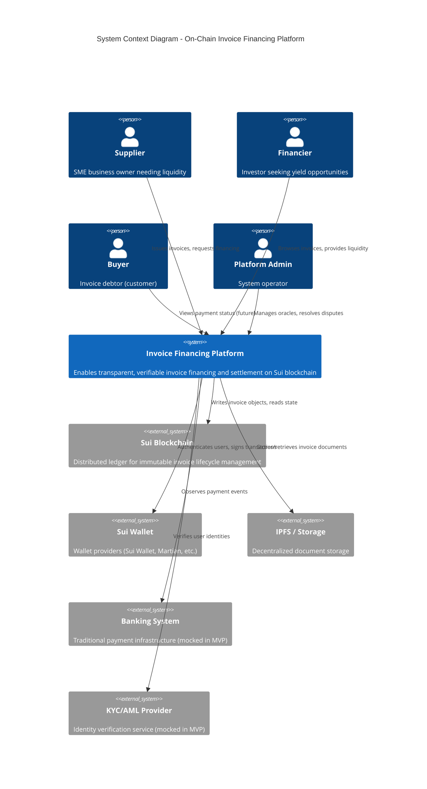
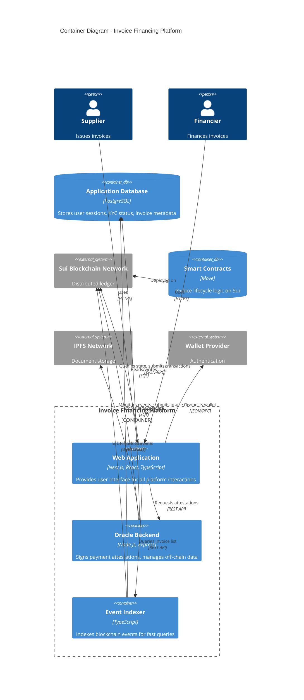
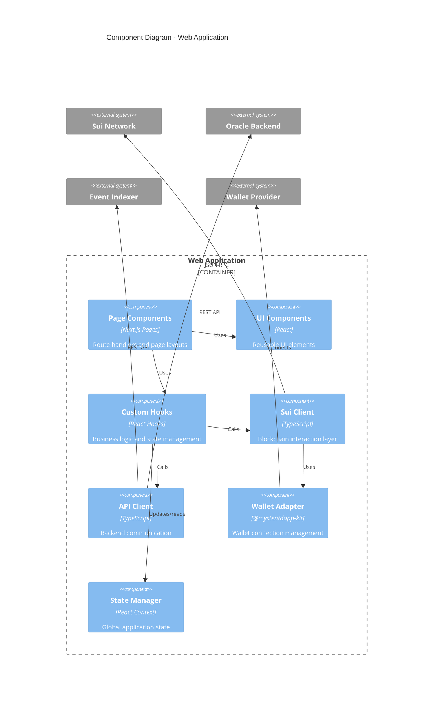
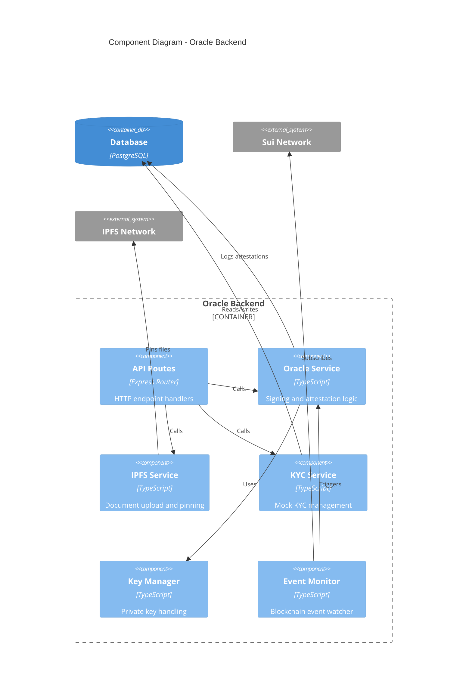
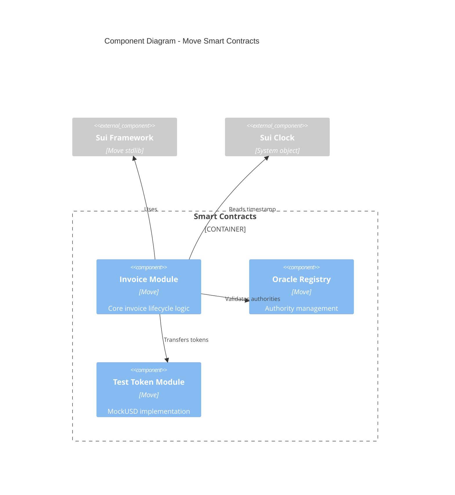
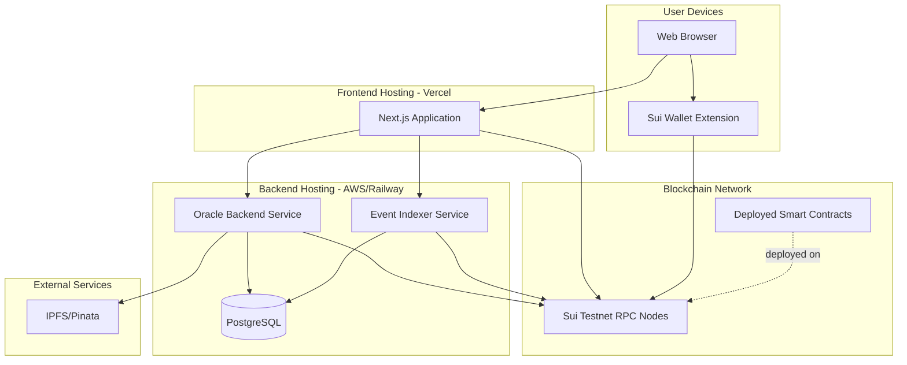

# C4 Model Architecture Documentation
## On-Chain Invoice Financing & Settlement Platform

**Version:** 1.0  
**Date:** November 14, 2025

---

## Introduction to C4 Model

The C4 model provides a hierarchical approach to software architecture documentation:
- **Level 1: System Context** - How the system fits into the world
- **Level 2: Containers** - High-level technology choices and communication patterns
- **Level 3: Components** - Decomposition of containers into components
- **Level 4: Code** - Implementation details (not included in this doc)

---

## Level 1: System Context Diagram

### Overview
Shows how the On-Chain Invoice Financing Platform fits into its environment, including all external actors and systems.

### Diagram



### Key Relationships

| Actor/System | Interaction | Description |
|--------------|-------------|-------------|
| **Supplier → Platform** | Issues invoices | Creates on-chain invoice objects, uploads documents, requests financing |
| **Financier → Platform** | Finances invoices | Browses marketplace, purchases invoices at discount, receives settlement |
| **Buyer → Platform** | Payment obligation | (Passive in MVP) Pays invoice off-chain, triggering settlement |
| **Platform → Sui Blockchain** | State management | Deploys smart contracts, mints invoice objects, executes state transitions |
| **Platform → Wallet Providers** | Authentication | Users connect wallets to sign transactions and prove identity |
| **Platform → IPFS** | Document storage | Stores invoice PDFs, retrieves via hash for verification |
| **Platform → Banking System** | Payment verification | Oracle observes real-world payments (mocked in MVP) |
| **Platform → KYC Provider** | Compliance | Verifies user identities before allowing platform participation |

### External Dependencies
- **Sui Blockchain:** Core infrastructure for immutable state and transactions
- **Wallet Ecosystem:** User identity and transaction signing
- **Storage Networks:** Document persistence and retrieval
- **Financial Infrastructure:** Real-world payment observation (future integration)
- **Compliance Services:** Regulatory compliance (planned integration)

---

## Level 2: Container Diagram

### Overview
Shows the high-level shape of the architecture and how responsibilities are distributed across containers.

### Diagram



### Container Details

#### 1. Web Application (Frontend)
**Technology:** Next.js 14, React, TypeScript, TailwindCSS  
**Responsibilities:**
- Render user interface for all user types
- Connect to Sui wallets (Sui Wallet, Martian)
- Display invoice marketplace
- Submit transactions to blockchain
- Show transaction status and confirmations
- Display audit trails and analytics

**Key Features:**
- Responsive design (mobile/desktop)
- Real-time updates via event subscription
- Wallet connection management
- Transaction signing flow
- Error handling and recovery

**Communication:**
- **Inbound:** HTTPS from users' browsers
- **Outbound:** 
  - JSON-RPC to Sui network (read state, submit transactions)
  - REST API to Oracle Backend (request attestations)
  - REST API to Event Indexer (query invoice lists)
  - WebSocket to Event Indexer (real-time updates)

#### 2. Oracle Backend
**Technology:** Node.js, Express, TypeScript  
**Responsibilities:**
- Sign payment attestations with authority private key
- Store and manage oracle signing keys
- Provide REST endpoints for attestation requests
- Monitor off-chain payment events (mocked)
- Handle IPFS document pinning
- Manage mock KYC status

**Key APIs:**
- `POST /api/oracle/sign-issuance` - Sign invoice issuance attestation
- `POST /api/oracle/sign-payment` - Sign payment confirmation
- `POST /api/documents/upload` - Upload and pin invoice document to IPFS
- `GET /api/kyc/status/:address` - Get KYC status (mocked)

**Security:**
- Private key stored in environment variables (MVP) / KMS (production)
- Rate limiting on attestation endpoints
- Request validation and signature verification

**Communication:**
- **Inbound:** REST API calls from Web Application
- **Outbound:**
  - JSON-RPC to Sui network (monitor events, submit transactions)
  - HTTP to IPFS (pin documents)
  - SQL to Application Database

#### 3. Event Indexer
**Technology:** TypeScript, Node.js  
**Responsibilities:**
- Subscribe to Sui blockchain events
- Index InvoiceIssued, InvoiceFinanced, PaymentConfirmed events
- Provide fast query API for invoice lists and history
- Aggregate analytics data

**Key APIs:**
- `GET /api/invoices` - List invoices with filtering
- `GET /api/invoices/:id` - Get invoice details
- `GET /api/invoices/:id/history` - Get invoice lifecycle events
- `GET /api/analytics/summary` - Get platform statistics

**Communication:**
- **Inbound:** REST API calls from Web Application
- **Outbound:**
  - WebSocket to Sui network (subscribe to events)
  - SQL to Application Database (store indexed data)

#### 4. Smart Contracts (Move Modules)
**Technology:** Move language on Sui  
**Responsibilities:**
- Define Invoice object structure and lifecycle
- Enforce state transition rules
- Verify oracle signatures
- Handle token transfers (financing, settlement)
- Emit events for all state changes
- Manage access control via OracleRegistry

**Key Modules:**
- `invoice_finance.move` - Core invoice lifecycle logic
- `test_token.move` - MockUSD stablecoin for demo (or use SUI)

**Key Structs:**
- `Invoice<CoinType>` - Core invoice object
- `OracleRegistry` - Stores oracle authority addresses
- `SettlementEscrow<CoinType>` - Holds settlement funds
- `FinanceDeal<CoinType>` - Records financing transaction (optional)

**Key Functions:**
- `issue_invoice<CoinType>(...)` - Mint new invoice
- `accept_finance<CoinType>(...)` - Finance an invoice
- `confirm_payment<CoinType>(...)` - Settle invoice after payment
- `raise_dispute<CoinType>(...)` - Flag invoice as disputed

#### 5. Application Database
**Technology:** PostgreSQL  
**Schema:**
- `users` - User profiles, KYC status
- `indexed_invoices` - Cached invoice data for fast queries
- `events` - Blockchain events log
- `sessions` - User authentication sessions
- `kyc_records` - KYC verification data (mocked)

**Communication:**
- **Inbound:** SQL queries from Oracle Backend and Event Indexer
- **Outbound:** None (data store)

### Data Flow Patterns

#### Invoice Issuance Flow
```
Supplier (Web App) 
  → Upload Document (Backend → IPFS)
  → Request Issuance Signature (Backend signs)
  → Submit Transaction (Web App → Sui Network)
  → Event Emitted (Sui Network)
  → Event Indexed (Indexer → Database)
  → UI Updated (Web App subscribes to updates)
```

#### Invoice Financing Flow
```
Financier (Web App)
  → Browse Invoices (Query Indexer)
  → Select Invoice
  → Submit Finance Transaction (Web App → Sui Network)
  → Tokens Transferred (Smart Contract execution)
  → Event Emitted
  → UI Updated
```

#### Settlement Flow
```
Buyer Pays Off-Chain
  → Oracle Observes Payment (Backend)
  → Oracle Signs Attestation (Backend)
  → Settlement Transaction Submitted (Web App → Sui Network)
  → Smart Contract Verifies Signature
  → Tokens Transferred to Financier
  → Event Emitted
  → UI Updated
```

---

## Level 3: Component Diagram - Web Application

### Overview
Detailed breakdown of the Web Application container.

### Diagram



### Component Details

#### Pages (Next.js Routes)
- `/` - Landing page
- `/dashboard` - User dashboard
- `/marketplace` - Invoice marketplace listing
- `/invoice/[id]` - Invoice detail view
- `/issue` - Issue new invoice form
- `/how-it-works` - Platform information

#### UI Components
- `Navigation.tsx` - Top navigation bar with wallet connection
- `Footer.tsx` - Footer component
- `InvoiceCard.tsx` - Invoice summary card for marketplace
- `InvoiceDetail.tsx` - Detailed invoice view
- `IssueForm.tsx` - Invoice creation form
- `FinanceButton.tsx` - Purchase invoice action
- `DisputeButton.tsx` - Raise dispute action
- `TransactionStatus.tsx` - Transaction progress indicator
- `AuditTrail.tsx` - Invoice history viewer

#### Custom Hooks
- `useWallet.ts` - Wallet connection state
- `useInvoices.ts` - Invoice querying and management
- `useTransaction.ts` - Transaction submission and tracking
- `useOracle.ts` - Oracle API interactions
- `useInvoiceForm.ts` - Form state and validation

#### Sui Client
**Responsibilities:**
- Connect to Sui RPC nodes
- Query on-chain objects and state
- Build and submit transactions
- Subscribe to events
- Parse transaction results

**Key Methods:**
- `queryInvoices(status)` - Get invoices by status
- `getInvoice(id)` - Get specific invoice object
- `issueInvoice(params)` - Submit invoice creation transaction
- `financeInvoice(invoiceId, payment)` - Submit financing transaction
- `confirmPayment(invoiceId, signature)` - Submit settlement transaction

---

## Level 3: Component Diagram - Oracle Backend

### Diagram



### Component Details

#### API Routes
**Endpoints:**
- `POST /api/oracle/sign-issuance` 
  - Input: { issuer, buyer_hash, amount, due_date, doc_hash }
  - Output: { signature, timestamp, nonce }
  
- `POST /api/oracle/sign-payment`
  - Input: { invoice_id, amount, payment_proof }
  - Output: { signature, timestamp }

- `POST /api/documents/upload`
  - Input: FormData with PDF file
  - Output: { ipfs_hash, cid }

- `GET /api/kyc/status/:address`
  - Output: { address, status: "approved" | "pending" | "rejected", timestamp }

#### Oracle Service
**Responsibilities:**
- Generate and sign attestations using Ed25519/ECDSA
- Implement nonce-based replay protection
- Validate request parameters
- Log all attestations to database

**Signature Format:**
```typescript
{
  message: {
    invoice_id: string,
    action: "issue" | "payment",
    timestamp: number,
    nonce: string,
    ...additionalData
  },
  signature: string, // hex-encoded
  publicKey: string  // oracle public key
}
```

#### Key Manager
**Responsibilities:**
- Load private keys from secure storage (env vars for MVP, KMS for production)
- Provide signing interface
- Implement key rotation logic (future)

---

## Level 3: Component Diagram - Smart Contracts

### Diagram



### Key Structs and Functions

#### Invoice Module
**Structs:**
- `Invoice<CoinType>` - Core invoice object with lifecycle state
- `SettlementEscrow<CoinType>` - Temporary escrow for settlement funds
- `FinanceDeal<CoinType>` - Optional record of financing transaction

**Entry Functions:**
- `issue_invoice<CoinType>()` - Create new invoice (with signature validation)
- `accept_finance<CoinType>()` - Finance an invoice (atomic token transfer)
- `deposit_payment<CoinType>()` - Oracle deposits settlement funds
- `confirm_payment<CoinType>()` - Complete settlement (with signature check)
- `raise_dispute<CoinType>()` - Flag invoice as disputed
- `cancel_invoice<CoinType>()` - Cancel unfunded invoice

**Events:**
- `InvoiceIssued<CoinType>` - Emitted on invoice creation
- `InvoiceFinanced<CoinType>` - Emitted on financing
- `PaymentDeposited<CoinType>` - Emitted when oracle deposits funds
- `PaymentConfirmed` - Emitted on settlement
- `SettlementExecuted<CoinType>` - Emitted when financier receives payout
- `DisputeRaised` - Emitted on dispute
- `InvoiceCanceled` - Emitted on cancellation

---

## Technology Stack Summary

### Frontend
- **Framework:** Next.js 14 (App Router)
- **UI Library:** React 18
- **Language:** TypeScript
- **Styling:** TailwindCSS
- **Blockchain SDK:** @mysten/sui.js, @mysten/dapp-kit
- **State Management:** React Context + hooks
- **HTTP Client:** fetch API

### Backend
- **Runtime:** Node.js 20+
- **Framework:** Express.js
- **Language:** TypeScript
- **Database Client:** pg (PostgreSQL)
- **Cryptography:** @noble/ed25519 or similar
- **IPFS Client:** ipfs-http-client or Pinata SDK

### Smart Contracts
- **Language:** Move
- **Platform:** Sui blockchain
- **Development:** Sui CLI, Move Prover (optional)

### Infrastructure
- **Blockchain:** Sui Testnet/Devnet
- **Database:** PostgreSQL 15+
- **Document Storage:** IPFS (Pinata, Web3.Storage, or self-hosted)
- **Hosting:** Vercel (frontend), AWS/Railway (backend)

---

## Deployment Architecture



---

## Security Architecture

### Authentication & Authorization
- **User Authentication:** Wallet-based (signature verification)
- **Oracle Authentication:** Private key signing (controlled by platform)
- **API Authentication:** Bearer tokens for backend APIs (future)

### Data Protection
- **In Transit:** HTTPS for all web traffic, TLS for database connections
- **At Rest:** Encrypted database, private keys in KMS (production)
- **On-Chain:** Only hashed identifiers and attestations (no PII)

### Access Control Layers
1. **Smart Contract:** OracleRegistry enforces oracle authority
2. **Backend API:** Rate limiting, request validation
3. **Frontend:** UI-level restrictions (not security boundary)

### Threat Mitigations
- **Replay Attacks:** Nonce-based signature scheme
- **Double Financing:** Invoice object ownership prevents duplication
- **Oracle Compromise:** Timelock for disputes, multi-sig planned
- **Smart Contract Bugs:** Testing, audit roadmap
- **Frontend Attacks:** Content Security Policy, CORS

---

## Scalability Considerations

### Current Capacity (MVP)
- **Users:** 100-1000 concurrent
- **Invoices:** 10,000+ objects
- **Transactions:** 10-100 per minute

### Scaling Strategies

#### Horizontal Scaling
- Frontend: CDN distribution via Vercel
- Backend: Stateless services, load balancer
- Indexer: Multiple instances with partitioned event streams

#### Database Optimization
- Indexed queries on invoice status, timestamps
- Materialized views for analytics
- Read replicas for query load

#### Blockchain Optimization
- Parallel transaction submission for independent invoices
- Batch event processing in indexer
- Optimized Move code (minimal gas)

---

## Monitoring & Observability

### Metrics
- **Transaction Success Rate**
- **API Response Times (p50, p95, p99)**
- **Blockchain Event Processing Lag**
- **Error Rates by Component**
- **User Journey Completion Rates**

### Logging
- Structured logging (JSON format)
- Correlation IDs across services
- Separate logs for: application, security, transactions

### Alerting
- Transaction failures spike
- Oracle signing errors
- Database connection issues
- High latency warnings

---

## Future Architecture Evolution

### Phase 1: Enhanced Reliability
- Multi-region backend deployment
- Hot standby oracle service
- Automated failover

### Phase 2: Decentralization
- Multi-sig oracle (threshold signatures)
- Federated identity (DID integration)
- Governance module for protocol upgrades

### Phase 3: Advanced Features
- Layer-2 indexing solution (The Graph equivalent)
- Real-time analytics engine
- Mobile native apps

### Phase 4: Enterprise Integration
- ERP connectors (SAP, Oracle, NetSuite)
- Bank API integrations
- Regulatory reporting automation

---

**Document Owner:** Architecture Team  
**Last Updated:** November 14, 2025  
**Next Review:** Post-MVP deployment
