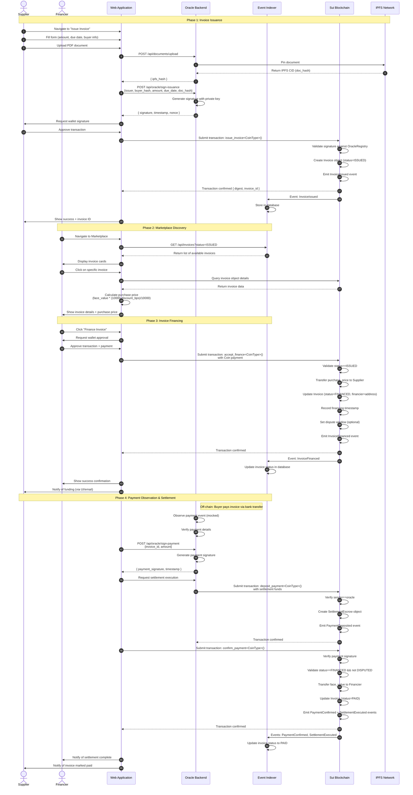
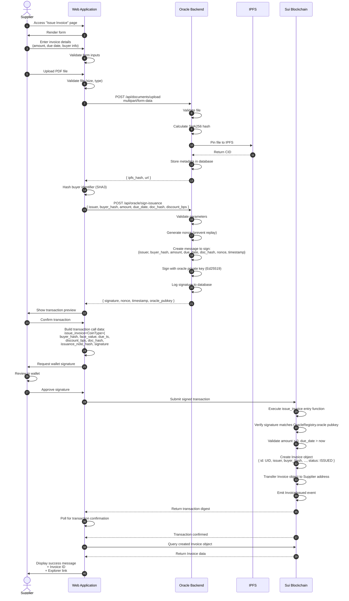
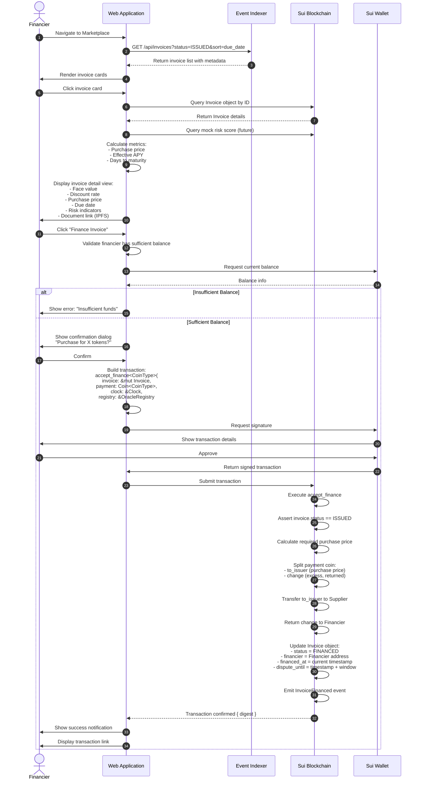
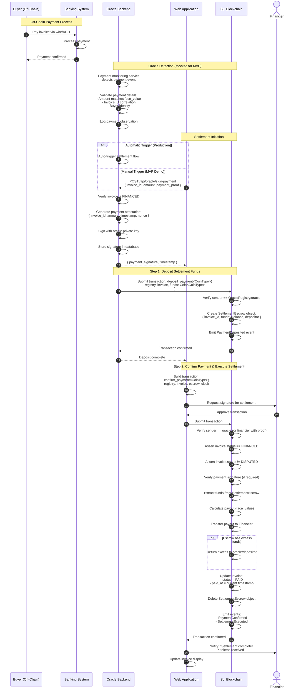
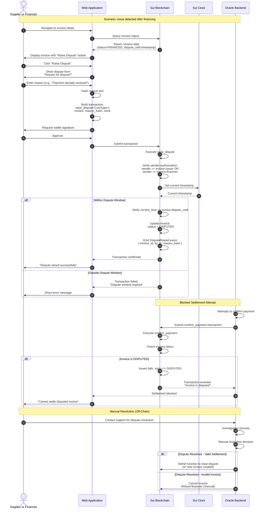
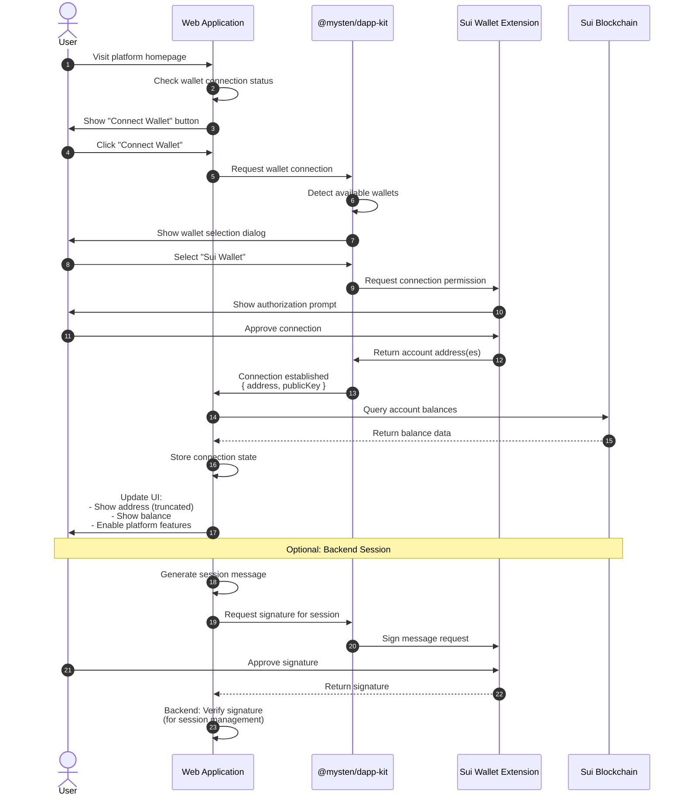
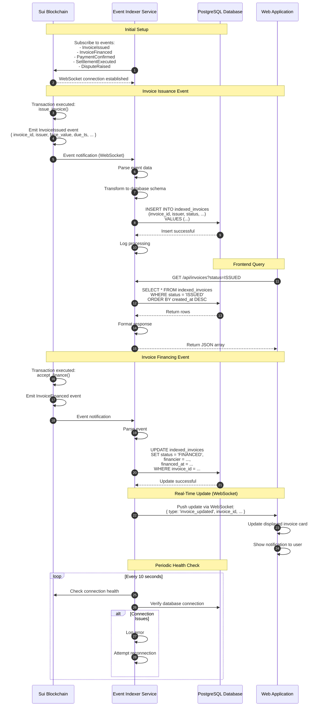
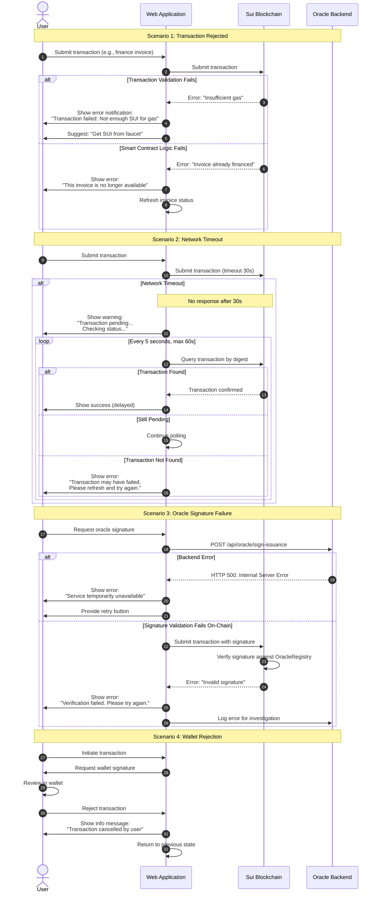
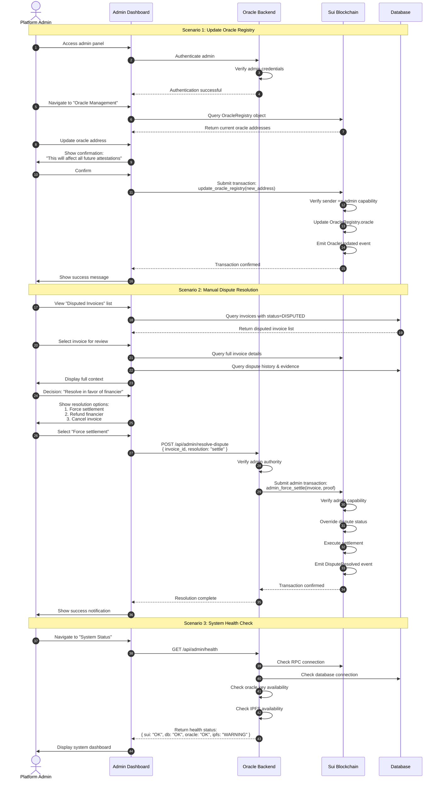

# Sequence Diagrams
## On-Chain Invoice Financing & Settlement Platform

**Version:** 1.0  
**Date:** November 14, 2025

---

## Overview

This document contains detailed sequence diagrams illustrating the key workflows and interactions in the On-Chain Invoice Financing & Settlement platform.

---

## 1. Complete Lifecycle Flow (Happy Path)

### End-to-End: Invoice Issuance → Financing → Settlement

---

## 2. Invoice Issuance (Detailed)

### Focus: Document Upload and Signature Verification

---

## 3. Invoice Financing (Detailed)

### Focus: Marketplace Discovery and Atomic Payment

---

## 4. Payment Confirmation & Settlement (Detailed)

### Focus: Oracle Attestation and Multi-Step Settlement

---

## 5. Dispute Flow

### Focus: Dispute Window and Settlement Blocking

---

## 6. Wallet Connection Flow

### Focus: User Authentication via Sui Wallet

---

## 7. Event Indexing Flow

### Focus: Real-Time Data Synchronization

---

## 8. Error Handling & Recovery Flow

### Focus: Transaction Failure Scenarios

---

## 9. Admin Operations Flow

### Focus: Oracle Management and Dispute Resolution

---

## Summary of Key Patterns

### 1. **Two-Phase Commitment**
- Oracle signing (off-chain) + blockchain execution (on-chain)
- Ensures cryptographic proof before state mutation

### 2. **Event-Driven Architecture**
- Smart contracts emit events
- Indexer consumes and stores for fast queries
- UI subscribes for real-time updates

### 3. **Atomic State Transitions**
- Single transaction updates all related state
- Prevents partial states (e.g., payment taken but invoice not updated)

### 4. **Defense in Depth**
- Multiple validation layers: UI, backend, smart contract
- Signature verification at multiple points

### 5. **Graceful Degradation**
- Fallback mechanisms for network issues
- User-friendly error messages with recovery paths

---

**Document Owner:** Engineering Team  
**Last Updated:** November 14, 2025  
**Next Review:** Post-integration testing
